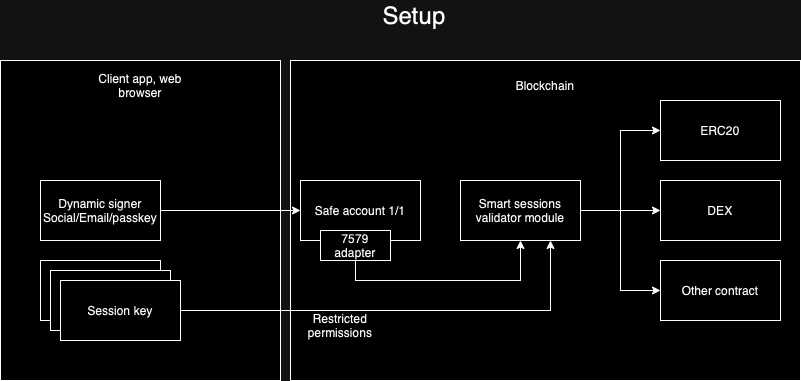

# Safe 7579 Tutorial - Smart Sessions

This project demonstrates the use of smart sessions with **Safe Protocol**, implemented using **Next.js** and **TypeScript**. The app includes components for managing contract actions and session keys, alongside utilities for blockchain interactions.

## Setup
In this demo, we’ll showcase the power of a Safe smart account configured for single-signer (1/1) functionality, integrated with a dynamically generated signer enabled by Rhinestone's Smart Sessions validator. This setup empowers the Safe account to operate with session-based keys, allowing predefined actions without requiring the owner’s signature for each transaction.

This approach leverages session keys with restricted permissions, ensuring security and flexibility for various blockchain interactions, including ERC20 transactions, DEX trades, and interactions with other contracts, all managed seamlessly through the validator module.


## Project Structure

- **app/components**: UI components such as `ActionRow`, `ActionTable`, and `SessionKeyForm` for managing contract actions and session data.
- **lib**: Utility functions for contract interaction (`abi.ts`, `sendUserOp.ts`), session management (`smartSession.ts`, `passkey.ts`), and permissionless actions (`permissionless.ts`).
- **abi**: Contains ABI data used for interacting with contracts.

## Installation

1. Clone the repository:
   ```bash
   git clone <repository-url>
   ```
2. Install dependencies
    ```bash
    pnpm install
    ```
3. Create an .env file from .env.example and fill in the required environment variables:
```bash
    NEXT_PUBLIC_PIMLICO_API_KEY=<Your Pimlico API Key>
    NEXT_PUBLIC_PRIVATE_KEY=<Your Private Key>
```
4. Run the development server:
```bash
    pnpm dev
```

## Key Features

- **Action Management**: A dynamic table (using `ActionTable.tsx` and `ActionRow.tsx`) for handling multiple contract actions.
- **Session Key Management**: Secure session key handling using the `SessionKeyForm.tsx`.
- **Permissionless Functionality**: Includes logic for managing permissionless contract interactions.

## Environment Variables

- `NEXT_PUBLIC_PIMLICO_API_KEY`: API key for interacting with the Pimlico service.
- `NEXT_PUBLIC_PRIVATE_KEY`: Private key for signing and submitting transactions.

## Contributing

Feel free to fork, submit pull requests, or open issues to improve this project.
